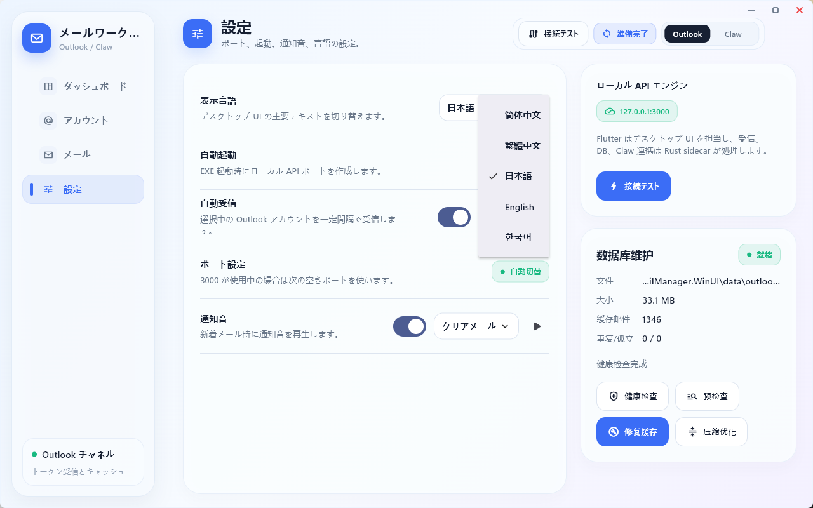

# Mail Linear Flutter

Mail Linear Flutter 是一个 Windows 桌面邮箱管理工具，使用 Flutter 构建桌面界面，并通过本地 Rust sidecar 提供邮件 API、缓存、收件和 ClawEmail 适配能力。

这个仓库是 Flutter 版本的开源发布仓库，包含：

- Flutter 桌面 UI 源码。
- Rust 本地服务源码。
- Windows x64 发布包构建方式。
- GPL-3.0 开源协议文本。

## 功能概览

- Outlook / Hotmail 令牌账号管理。
- 本地缓存邮件读取。
- 手动收取最新邮件。
- 验证码识别与复制辅助界面。
- ClawEmail 绑定、子邮箱同步和收件入口。
- 本地 Rust sidecar 启动，不依赖远程中转服务保存账号数据。

## 界面截图




## Repository Layout

- `mail_linear_flutter/` - Flutter 桌面应用。
- `native-mail-api/` - Flutter 应用启动和调用的 Rust 本地服务。
- `docs/` - 项目说明和迁移文档。
- `LICENSE` - GNU GPL v3.0 开源协议。
- `REFERENCES.md` - 项目参考来源、借鉴方向和合规说明。

## 环境要求

- Windows 10/11 x64。
- Flutter 3.41 或更新版本，并启用 Windows desktop 支持。
- Rust stable toolchain。
- Visual Studio Build Tools，安装 Windows 桌面 C++ 构建组件。

## 构建

先构建 Rust 本地服务：

```powershell
cd native-mail-api
cargo build --release
```

再构建 Flutter Windows 应用：

```powershell
cd mail_linear_flutter
flutter pub get
flutter test --no-pub
flutter analyze --no-pub
flutter build windows --release
```

如果要制作可直接分发的 Windows 文件夹，需要把 Rust sidecar 放到 Flutter release 输出目录：

```powershell
New-Item -ItemType Directory -Force build\windows\x64\runner\Release\runtime\native
Copy-Item ..\native-mail-api\target\release\outlook-mail-native.exe build\windows\x64\runner\Release\runtime\native\
```

最终可运行文件位于：

```text
mail_linear_flutter\build\windows\x64\runner\Release\OutlookMailManager.exe
```

## 运行说明

发布包解压后，直接运行 `OutlookMailManager.exe`。应用启动时会自动寻找并启动：

```text
runtime\native\outlook-mail-native.exe
```

本地数据默认写入 Windows 用户目录下的 `OutlookMailManager.WinUI` 数据目录。账号 token、邮件缓存等敏感数据不会提交到本仓库。

## 开源协议

本项目按 GNU General Public License v3.0 开源，详见 `LICENSE`。

这意味着你可以自由使用、研究、修改和分发本项目；如果你分发修改后的版本，也需要按 GPL-3.0 继续开放对应源码。

## 参考与致谢

本项目不是直接 fork 或复制某一个开源项目，而是在本地桌面邮箱管理工具的目标下，参考了若干开源项目的产品思路、功能边界和接口方向。详细说明见 [`REFERENCES.md`](REFERENCES.md)。

## English Summary

Mail Linear Flutter is a Windows desktop mail manager built with a Flutter UI and a local Rust sidecar. The Flutter shell handles Outlook and ClawEmail workflows, while `native-mail-api` provides the local HTTP API, mail fetching, cache, and Claw adapter. The project is released under GPL-3.0.
